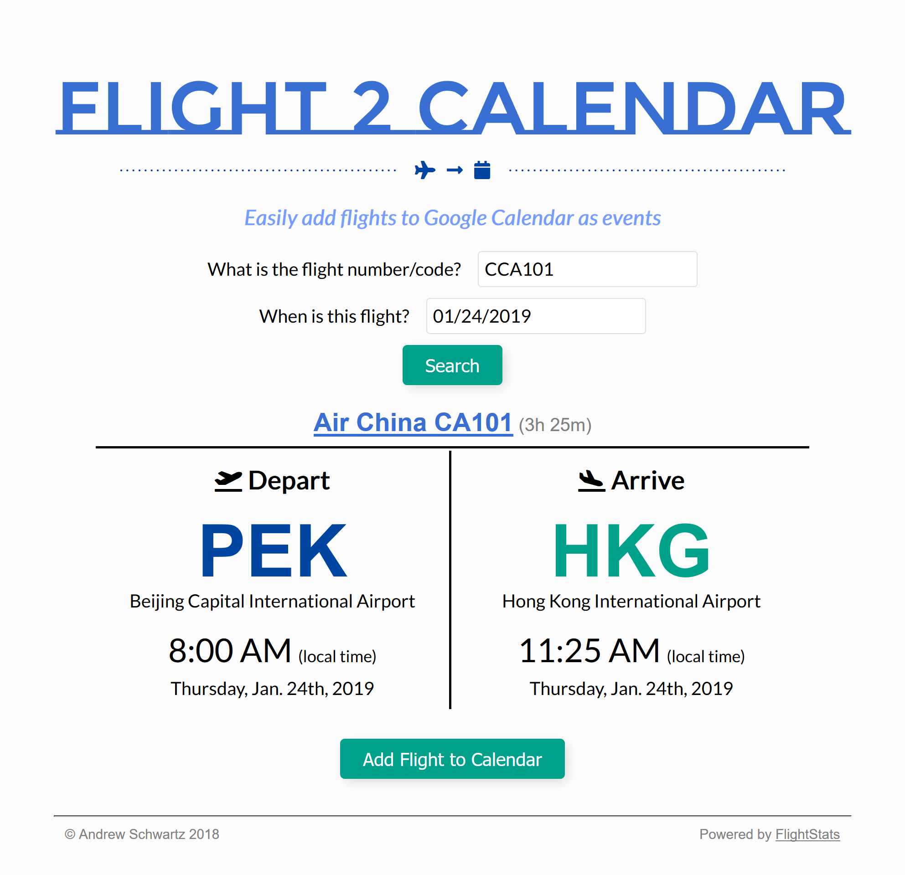
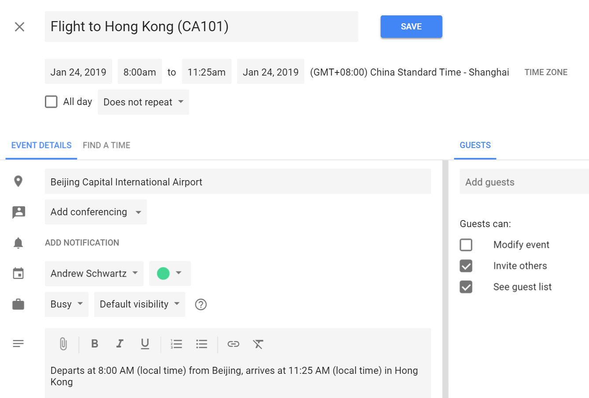
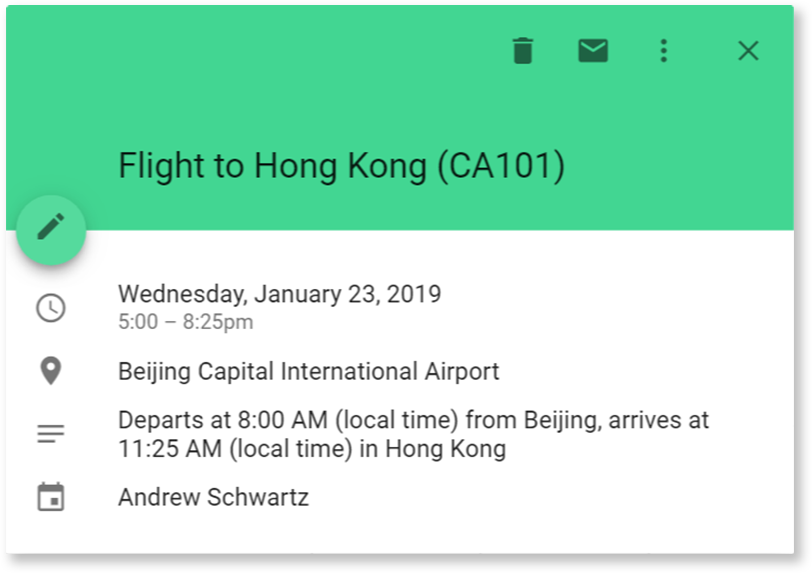

# Flights --> Google Calendar Events
A webapp to generate Google Calendar events based off of flight information

## Description
The app shows results for a user's flight like this:



...and then lets users link directly to a Google Calendar event like this one:



...which then creates an event that looks like this:




## Usage
In order to run this app, you will need to get a FlightStats API key, which can be obtained on the [Flight Stats website](https://developer.flightstats.com).

Once you have registered for the FlightStats API, you will need to add a file at the root directory, titled `config.js` as follows:

```js
var config = { 
  appId: '',
  apiKey: ''
}

```
Once that is complete, the app should all be good to go!
